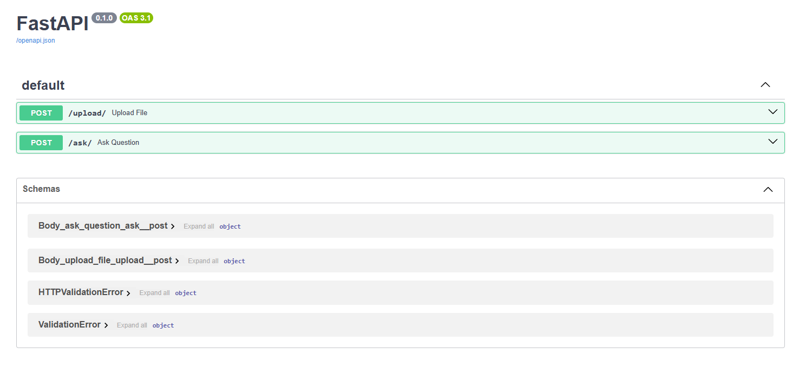

# 🔍 Semantic Search with OpenAI, Pinecone and FAISS

A technical demo of **semantic vector search** using [OpenAI Embeddings](https://platform.openai.com/docs/guides/embeddings), [Pinecone](https://www.pinecone.io/), and [FAISS](https://github.com/facebookresearch/faiss).

This project demonstrates the core principles of **retrieval-augmented generation (RAG)** by embedding textual data into high-dimensional vectors and querying them efficiently using vector similarity.

---

## ⚙️ Features

- ✅ Document chunking and preprocessing  
- 🧠 Embedding generation with `text-embedding-3-small` (1536D)  
- 📦 Vector storage using:
  - 🌐 **Pinecone** (cloud-based)
  - 💾 **FAISS** (local, offline)
- 🔍 Cosine similarity-based semantic search
- 💬 GPT-4.1-mini integration for answer generation with natural language formatting

---

## 📚 Technologies Used

| Tool       | Purpose                            |
|------------|------------------------------------|
| `OpenAI`   | Embedding generation + LLM answers |
| `Pinecone` | Scalable vector search DB (cloud)  |
| `FAISS`    | Local vector DB (for offline use)  |
| `LangChain` (opcional) | Document loading & text splitting |
| `FastAPI`  | API backend for upload and queries |
| `NumPy`    | Vector similarity calculations     |

---

## 🚀 Use Cases

- Chat with your documents (PDFs, TXT, DOCX)
- Course recommendation or search engines
- FAQ assistants with custom datasets
- AI copilots that ground answers in real data

---

## 📂 Structure
```
├── main.py # FastAPI app for upload + ask
├── open_faiss.py # FAISS-only version
├── pinecone_embed.py # Pinecone vector insert + query
├── vectorstore/ # Local FAISS files
├── uploads/ # Uploaded files
└── README.md # You're here!
```


---

## 🧠 About Embeddings

Text embeddings are high-dimensional numerical representations of text. They capture **semantic meaning**, allowing us to compare similarity between texts mathematically. OpenAI’s `text-embedding-3-small` produces vectors of size **1536**, optimized for performance and cost.

These vectors are stored in a vector database like Pinecone or FAISS, where we can perform **fast nearest neighbor search** using **cosine similarity** to retrieve the most relevant pieces of content.

---

## 📎 Example Prompt Flow

```text
[1] User asks: "How much does the Python course cost?"

[2] → Embed the question
[3] → Query Pinecone with top_k=1
[4] → Extract metadata: "Course: Python - Price: R$ 1.259 ..."
[5] → Send to GPT to generate a human-like answer
```

🛠 Setup
```
pip install -r requirements.txt
```

Create a .env file or set your API keys manually:
```
OPENAI_API_KEY=sk-...
PINECONE_API_KEY=pcsk-...
```

## Visualização da API

Abaixo está um print da aplicação FastAPI com os endpoints `/upload` e `/ask`:



Author
Created by @rafael.moura – Data & AI enthusiast 🚀